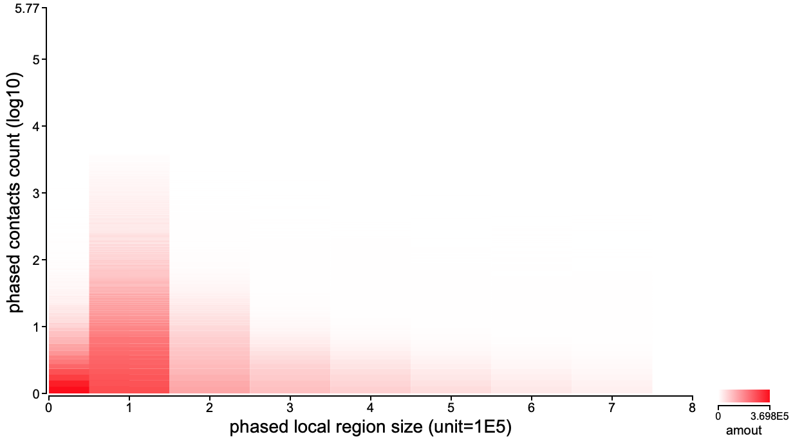

# plotLocReg
`plotLocReg` loads statistics generated by `haplo_div` to plot information of phased local region which calculates the **local contacts ratio**.

## Usage

```
Usage:   perl HaploHiC.pl plotLocReg <[Options]>

Options:

  # plot phased local region information #

  # Inputs and Outputs #
   -dir     [s]  folder stores results of func 'haplo_div'. <required>
   -svg     [s]  svg figure output. <required>

  # Options #
   -max_lg  [s]  maximum size of local region. [2E7]
   -tmr_lg  [f]  ratio for unilateral trimming from largest local region size. [0.01]
   -tmr_pc  [f]  ratio for unilateral trimming from phased link counts. [0.01]
   -amt_fc  [s]  manually set the top of amount. [0]
   -rgb     [s]  rgb of heatmap color. ['255,0,0']

   -h|help       Display this help info.

Version:
   0.05 on 2019-04-08

Author:
   Wenlong Jia (wenlongkxm@gmail.com)
```

## Inputs

`plotLocReg` gets the output folder path of `haplo_div` via option `-dir`, and automatically loads all merged **statOfPhasedLocReg.gz**.

In the header of merged **statOfPhasedLocReg.gz**, the unit of local region is declared.

## Outputs

In the calculation of **local contacts ratio**, HaploHiC extends the local region with unit size till the phased contacts count reaches minimum.
HaploHiC summaries how many Hi-C PE-reads with '*UK*' end(s) are processed by certain phased contacts in local region with certain size, and `plotLocReg` plots this distribution.
Here is one instance.

